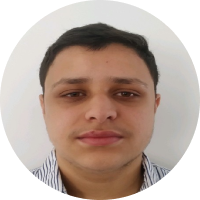
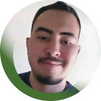

 
    
 

 

 O FeirAqui nasceu com a proposta de oferecer aos nossos clientes uma plataforma de delivery de feiras com acessibilidade e interatividade, para que todos consigam ter fácil acesso a produtos frescos de qualidade!

 

<b>🍉 Missão:</b> tornar o acesso a feiras livres fácil para
todos, estabelecendo uma ponte entre o feirante e o freguês.
   
<b>🍍 Visão:</b> ser o maior delivery de feiras do Brasil. Para nossos
clientes e funcionários: uma relação com foco na sustentabilidade, escalabilidade e eficiência,
sempre visando o crescimento.
   
<b>🍒 Valores: </b>  modernidade, praticidade, conforto, acessibilidade e
sustentabilidade ambiental e social.

🖥️ **Tecnologias utilizadas:**  

 

✏️ **Ferramentas utilizadas:**  

 

👋🏻 **Conheça o nosso time:**

 

 

Murilo é nosso Product Owner e designer 👨🏻‍💻
 
Veja seu [GitHub](https://github.com/MuriloSilvs) e [LinkedIn](https://www.linkedin.com/in/murilo-silva-a42873232/)

 
 

Carlos Flores é nosso Product Owner e dev no back-end 👩🏻‍💻
 
Veja seu [GitHub](https://github.com/Flores-Carlos) e [LinkedIn](https://www.linkedin.com/in/carlos-gabriel-f3/)

  
 

Isabelle Victoria é nossa Scrum Master e dev no front-end👩🏻‍🎨
 
Veja seu [GitHub](https://github.com/Isabvictoriaps) e [LinkedIn](https://www.linkedin.com/in/isabellevictoria)

 
 

Lucas Lira é nosso dev no front-end 👨🏻‍💻
 
Veja seu [GitHub](https://github.com/Tutinhas) e [LinkedIn](https://www.linkedin.com/in/lucas-lira-86869b1b0/)

  
 

Lucas Santiago é nosso designer 👩🏻‍🎨
 
Veja seu [GitHub](https://github.com/manosanti) e [LinkedIn](https://www.linkedin.com/in/lucassantiagoconceicao/)

 
 

Raphael Oliveira é nosso designer e dev no front-end 👩🏻‍🎨
 
Veja seu [GitHub](https://github.com/Kapphael) e [LinkedIn](https://www.linkedin.com/in/kapphael/)

  
 

Christian de Souza é nosso dev no back-end 👩🏻‍💻
 
Veja seu [GitHub]() e [LinkedIn]()

 
 

Gabriel Leão é nosso dev no back-end 👩🏻‍💻
 
Veja seu [GitHub]() e [LinkedIn]()

   

